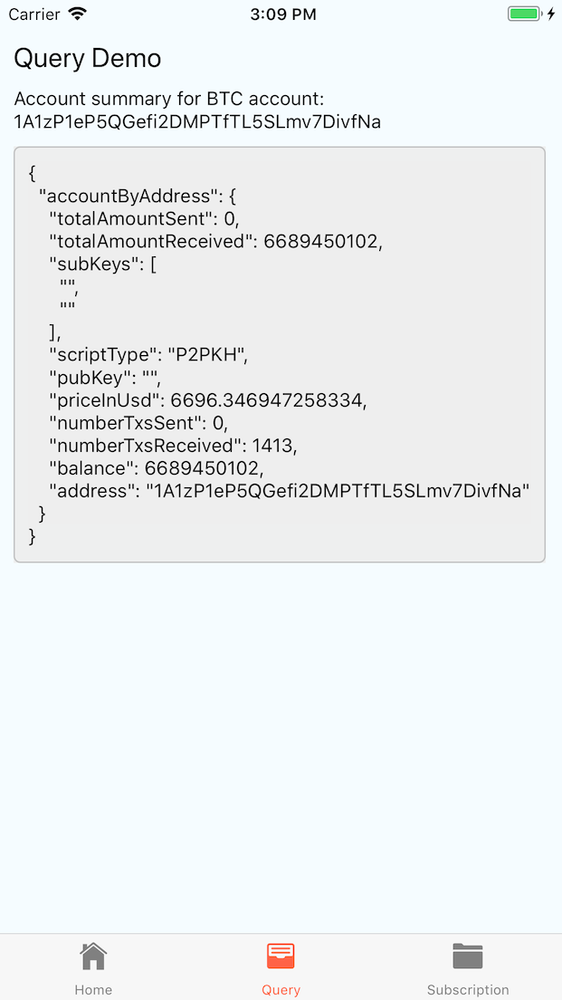
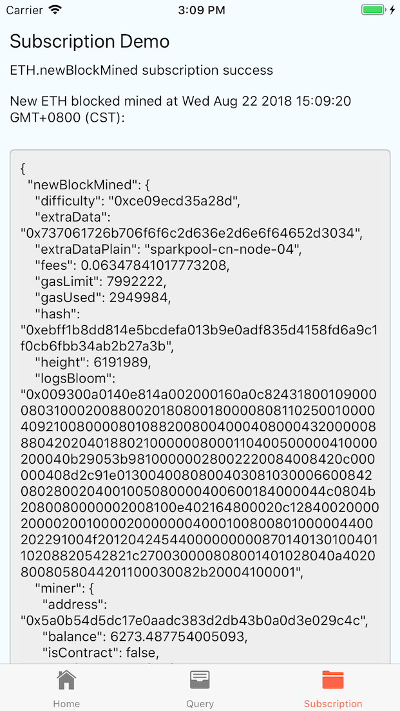

# ocap-react-native-starter


> 集成了 [OCAP JS SDK](https://github.com/ArcBlock/ocap-javascript-sdk/tree/master/packages/ocap-js) 的 React-Native 种子项目，参照 React-Native 官方的[操作步骤](https://facebook.github.io/react-native/docs/getting-started.html)，使用 `react-native-cli` 初始化，APP 里面提供的界面可以看本文档末尾的截图。

> For English documentation, please checkout [README.md](./README.md)

## 使用方法

```shell
git clone https://github.com/ArcBlock/ocap-react-native-starter.git
cd ocap-react-native-starter
yarn # npm install
react-native run-ios # You can use XCode if you are familiar
```

## OCAP SDK 代码示例

- SDK 初始化和封装：[src/libs/ocap.js](./src/libs/ocap.js)
- 基于 SDK 做查询：[src/pages/Query/index.js](./src/pages/Query/index.js)
- 基于 SDK 做实时数据订阅：[src/pages/Subscription/index.js](./src/pages/Subscription/index.js)

## OCAP SDK 文档

- [SDK 源码和文档首页](https://github.com/ArcBlock/ocap-javascript-sdk/tree/master/packages/ocap-js)
- [Bitcoin API 列表和响应格式](https://github.com/ArcBlock/ocap-javascript-sdk/blob/master/packages/ocap-js/docs/btc.md)
- [Ethereum API 列表和响应格式](https://github.com/ArcBlock/ocap-javascript-sdk/blob/master/packages/ocap-js/docs/eth.md)

## OCAP 提供的工具

- [OCAP Playground：快速执行查询、预览结果](https://ocap.arcblock.io)
- [OCAP Playbook：记录、分享基于区块链的数据研究](https://ocap.arcblock.io)

## 内含的三方库

- 导航库：[react-navigation](https://reactnavigation.org/)
- 图标库：[react-native-vector-icons](https://github.com/oblador/react-native-vector-icons)

## APP 截图




