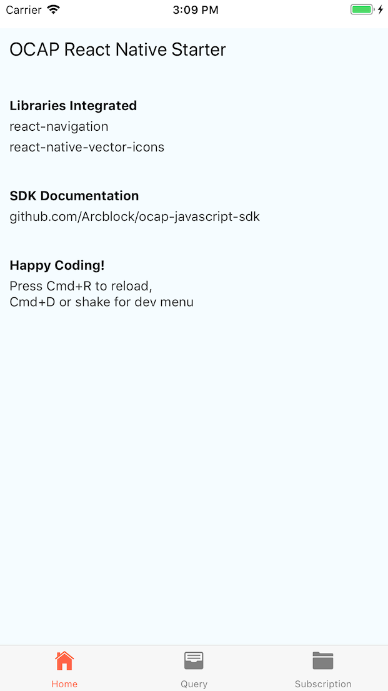
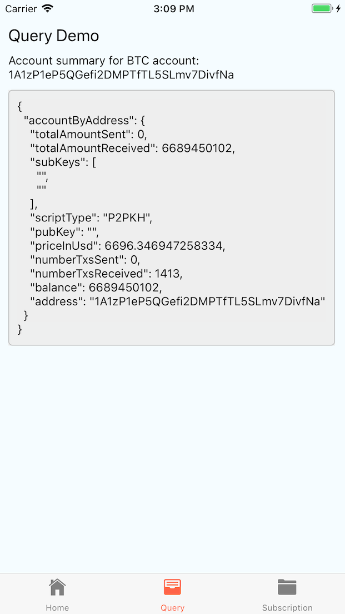
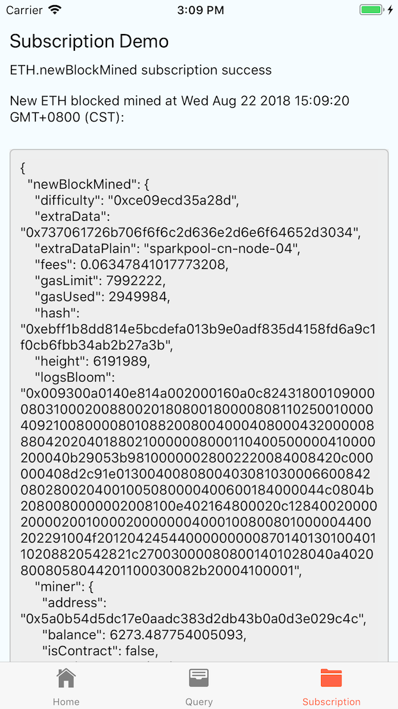

# ocap-react-native-starter

> OCAP Starter project for react-native with OCAP JS SDK integrated.

This project is bootstrapped using `react-native-cli` with instructions from [here](https://facebook.github.io/react-native/docs/getting-started.html), and with OCAP JS SDK integrated, see screenshot for more detail.

## SDK Usage Example

- [src/libs/ocap.js](./src/libs/ocap.js)
- [src/pages/Query/index.js](./src/pages/Query/index.js)
- [src/pages/Subscription/index.js](./src/pages/Subscription/index.js)

## SDK Documentation

- [SDK Homepage](https://github.com/ArcBlock/ocap-javascript-sdk/tree/master/packages/ocap-js)
- [SDK API Specification](https://github.com/ArcBlock/ocap-javascript-sdk/blob/master/packages/ocap-js/docs/spec.md)
- [Bitcoin API and Response Formats](https://github.com/ArcBlock/ocap-javascript-sdk/blob/master/packages/ocap-js/docs/btc.md)
- [Ethereum API and Response Formats](https://github.com/ArcBlock/ocap-javascript-sdk/blob/master/packages/ocap-js/docs/eth.md)

## Other Tools

- [OCAP Playground](https://ocap.arcblock.io)
- [OCAP Playbook](https://ocap.arcblock.io)

## Other Libraries Included

- [react-navigation]()
- [react-native-vector-icons]()

## APP Screenshots

